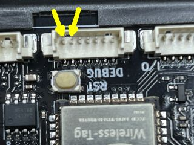

# TINYRadio: Internet Radio for ESC32-Board WT32-SC01-PLUS  
## Author/Copyright: DrNeurosurg - this is a fork to apply some changes.  

## 

## 

## Hardware
**PLEASE NOTE:** TINYRadio will only run on WT32-SC01-PLUS, not on WT32-SC01!
The board contains a mono decoder and amplifier.
For details and external connectors see [WT32-SC01-PLUS Datasheet](https://www.marutsu.co.jp/contents/shop/marutsu/datasheet/khe_WT32-SC01-PLUS.pdf?srsltid=AfmBOoohYPBXUQcbwF3fNsmzJ99yOVGr-nubaThOd_DJB-lqxFCud59W) and [WT32-S3-WROVER](https://en.wireless-tag.com/product-item-17.html).

You will need one 2-pin JST-connector (1.25mm) for the speaker, another one to enable the flashing mode (see below). I found the following set very helpful, especially when I needed more external connectors:
[Connector/Cable Set](https://www.amazon.de/Steckverbinder-vorgecrimpte-kompatibel-PicoBlade-Silikonkabel/dp/B07S18D3RN)

## Software
- Install Visual Studio Code, Platformio and the Espressif IDF extension - there are several online tutorials.
- Download repository as zip file and extract to a project folder
- Open project folder in platformio

## Configuration
Chose your hardware configuration and adjust the parameters accordingly:

### Just the board and a speaker
This is the minimal configuration - for small radios or as a first test of TinyRadio.
Due to lack of a speaker, I have not tested this setup myself.
- Connect external speaker to the corresponding connector
- Comment out the following parameter definitions:
- //#define USE_EXTERNAL_DAC in lib/AudioTask/src/audiotask.cpp
- //#define USE_POT_VOLUME in include/tinyDefs.h
- //#define USE_ENCODER_TUNE_SM in include/tinyDefs.h

### External DAC
If you prefer a stereo line out connection, you can use an external DAC (encoder). I tested with the [DAC board from Adafruit]https://www.adafruit.com/product/3678 but there are several other options.
- Connect external DAC to VCC and GND. The I2S interface is connected to GPIO 11, 12 and 13.
- #define USE_EXTERNAL_DAC in lib/AudioTask/src/audiotask.cpp

### Volume Potentiometer
Volume can be controlled by a potentiometer (10k, linear), optional with power switch for the radio.
- Connect potentiometer to GND, GPIO 10 and 3.3V (**NOT 5V, this can destroy your board!!!)
- #define USE_POT_VOLUME in include/tinyDefs.h

### Station Switch
A rotary encoder can be used to switch between stations. This code implements a state machine to determine steps and direction.
- Connect encoder to GND, and GPIO 14 and 21
- #define USE_ENCODER_TUNE_SM in include/tinyDefs.h
- #define USE_ENC_TUNE_INTERNAL_PULLUP for an encoder without pullup resistors (some encoder breakup boards have their own)

## Upload
- Connect pin 6 of the debug connector to GND - on the debug connector, these are pins 6 and 7. **Make sure not to short-circuit the wrong side of the connector, this may destroy your board!!**
The right pins (6 and 7) are the two pins directly above the reset button: 

- Press reset to enable flash mode
- Build and upload
- Disconnect pin 6 from GND and power cycle the board
- Enjoy!
